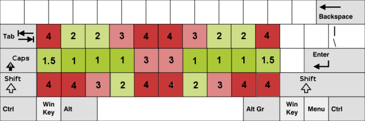
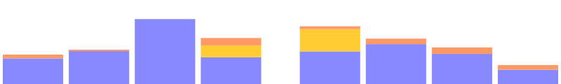
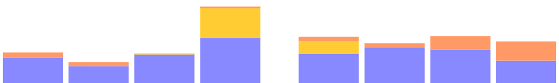
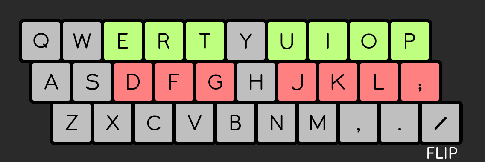

+++
title = "Analyse et optimisation"
date = 2024-10-20T18:01:23+01:00
author = "kaze"
tags = ["communauté", "technique", "outils"]
+++

<!--
Étant mondialement connu pour mon objectivité totale, on me demande souvent des
trucs (et c’est bien normal). Notamment pour des questions liées aux claviers.

— C’est vrai qu’Ergo‑L est meilleur que Dvorak en anglais ?
— Totalement. En même temps, Dvorak date des années 1930, hein.
— Et meilleur que Bépo en français aussi ?
— Reste poli. Tu nous prends pour qui ?
— J’ai vu une variante de Bépo qui dit qu’elle est mieux.
— Haha, c’est mignon ça ! Mais non.
-->

Pour que chacun·e puisse comprendre en quoi Ergo‑L se distingue et quels sont
ses avantages et inconvénients sur les autres layouts, il était grand temps
d’écrire un article sur l’art délicat de l’analyse et de l’optimisation des
dispositions de clavier.

<!--more-->

:::{.highlight style="max-width: 32em;"}
- [Les fondamentaux]
  - [la heatmap]
  - [la charge des doigts]
  - [les digrammes]
  - [les trigrammes]
- [Critères d’évaluation]
  - [métriques consensuelles]
  - [SHU, <i lang="en">same hand usage</i> ?]
  - [distance parcourue ?]
  - [note globale ?]
- [Optimiser pour une note globale ?]
  - [l’approche CarpalX]
  - [l’approche Optimot]
- [Optimiser façon Ergonaute !]
  - [la méthode]
  - [les outils]
  - [la communauté]
- [Les autres analyseurs]
  - [CarpalX]
  - [KLA (keyboard-layout-analyzer)]
  - [Colemak-DH]
  - [Oxeylyzer ❤️]
  - [Kalamine 🚀]
- [Conclusion]
:::

Les fondamentaux
--------------------------------------------------------------------------------

Quels sont les principales caractéristiques d’une bonne disposition de clavier ?

### La heatmap

L’optimisation la plus évidente pour une disposition de clavier consiste à
placer les touches les plus fréquemment utilisées aux meilleurs emplacements :

- sur les 8 positions de repos
   ([A]{.kbd}[S]{.kbd}[D]{.kbd}[F]{.kbd} et [J]{.kbd}[K]{.kbd}[L]{.kbd}[;]{.kbd} en Qwerty)
- sur les 4 positions des majeurs et annulaires de la rangée supérieure
   ([W]{.kbd}[E]{.kbd} et [I]{.kbd}[O]{.kbd} en Qwerty)
- sur les 2 positions des index de la rangée inférieure
   ([V]{.kbd} et [M]{.kbd} en Qwerty)

Ces positions correspondent à celles notées 1 à 2 par le projet
[Workman](https://workmanlayout.org/#back-to-the-drawing-board).

On notera au passage que la question de l’accessibilité hors du pavé central de
3×10 touches ne s’est jamais posée chez Workman : le principe [1DFH][] va de soi
pour les dispositions anglo-saxones.

### La charge des doigts

Une autre optimisation de base consiste à équilibrer la charge de travail des
doigts :

- les doigts forts (index, majeur) peuvent supporter plus de charge que les
  auriculaires, qui sont déjà très sollicités avec [Entrée]{.kbd},
  [Backspace]{.kbd}, [Tab]{.kbd}, [Shift]{.kbd}…
- la charge est agravée par les extensions, i.e. les touches qui sont notées 3
  ou plus par le projet Workman (V. ci-dessus).

On affiche en bleu la charge liée aux touches notées 1 à 2, en jaune celle des
touches notées 3, et en orange celles notées 4 ou plus — ce qui inclut les
touches trop excentrées pour être évaluées par Workman, et qui enfreignent le
principe [1DFH][] auquel nous autres Ergonautes sommes si attachés.

### Les digrammes

Un digramme est un enchainement de deux touches.
Tout digramme appartient à l’une des catégories suivantes :

- alternance de mains : les touches sont sous deux mains différentes
- roulement : les touches sont sous deux doigts différents d’une même main
    - roulement intérieur : les touches s’enchainent de l’auriculaire vers l’index
    - roulement extérieur : les touches s’enchainent de l’index vers l’auriculaire
- digramme de même doigt (SFB) : deux touches différentes à enchainer avec le
  même doigt (= le pire enchaïnement qui soit)
- répétition (SKB) : la même touche est pressée deux fois.

Les roulements intérieurs sont considérés comme les enchainements les plus
confortables. Entre alternance de mains et roulements extérieurs, c’est plus une
question de préférence personnelle. On identifie aussi deux types de mauvais
roulements :

- les roulements avec « ciseau », qui requièrent un changement de rangée
  inconfortable, comme [C]{.kbd}[R]{.kbd} en Azerty ou Qwerty ;
- les roulements avec extension (LSB, <i lang="en">lateral stretch bigrams</i>),
  qui incluent une touche d’une colonne excentrée ou de la rangée des chiffres.

Le SFU est le principal indicateur du niveau d’optimisation d’une disposition de
clavier, et on peut être tenté de l’utiliser comme indicateur principal de la
qualité d’une disposition de clavier. Mais attention, un SFU très bas cache
parfois des défauts rédhibitoires ailleurs — notamment sur les ciseaux, les
extensions, ou la charge des doigts.

### Les trigrammes

Un trigramme est un enchainement de trois touches.

Les critères alternance / roulement / même doigt s’appliquent toujours, mais on
ajoute encore la notion de « redirection » pour les trigrammes faits d’une même
main avec un changement de direction, comme [D]{.kbd}[S]{.kbd}[F]{.kbd} ou
[K]{.kbd}[J]{.kbd}[L]{.kbd} en Azerty ou Qwerty.

La redirection est qualifiée de « mauvaise » quand elle ne fait pas intervenir
l’index.

Critères d’évaluation
--------------------------------------------------------------------------------

### Métriques consensuelles

Un analyseur de disposition de clavier va, en tout premier lieu, fournir des
métriques sur les principaux critères :

- la heatmap doit être centrée sur les positions confortables ;
- la charge des doigts doit être équilibrée et épargner les auriculaires ;
- le taux de SFB (= SFU, <i lang="en">same finger usage</i>) doit être le plus
  bas possible ;
- le nombre de ciseaux et LSB (= <i lang="en">lateral stretch bigrams</i>) doit
  être le plus bas possible ;
- le taux de mauvaises redirections doit être le plus bas possible.

Le dernier point est moins souvent pris en considération, mais du point de vue
des Ergonautes c’est une grosse erreur que de le négliger.

### SHU, <i lang="en">same hand usage</i> ?

Le SHU mesure la répartition entre alternances de mains et roulements.

À l’époque des machines à écrire mécaniques, le SHU devait être le plus bas
possible car les roulements coinçaient souvent les marteaux : Qwerty, et encore
plus Dvorak, ont été développés dans cet objectif. C’est aussi le cas de Bépo et
ses nombreuses variantes.

Mais de nos jours, les claviers informatiques n’ayant pas de contrainte de ce
type, cette métrique du SHU n’est plus utilisée pour mesurer la qualité d’une
disposition — voire, elle est souvent utilisée dans l’autre sens : un SHU élevé
caractérise une disposition « rolly », i.e. privilégiant les roulements. C’est
le cas de la très grande majorité des dispositions modernes, dont Workman et
Ergo‑L.

:::{.highlight lang="en"}
> In designing Workman, I preferred a high SHU (low alternation) over a low SHU
> (high alternation). I think high alternation is beneficial if you’re typing on
> mechanical typewriters but not necessarily on modern keyboards. […]

> It is much more efficient to ride the momentum of a single arm or wrist stroke
> and type a combo rather than just one key.
:::
:::{style="text-align: right"}
— [Kevin DeLoach][kdeloach], disposition [Workman][]
:::

C’est un constat qui est également partagé par bon nombre de Bépoètes.

:::{.highlight}
> La frappe d’un roulement facile peut être plus rapide, plus confortable et
> moins sujette à la faute de frappe qu’une alternance de mains.
:::
:::{style="text-align: right"}
— extrait des notes de conception de [Béop][]
:::

Et c’est un sujet qui a été longuement détaillé par [Nuclear-Squid][] dans sa
conférence  [Ergonomie clavier : l’ère post-Dvorak][cdl2023-slides] 
([vidéo][cdl2023-video]).

Attention : les dispositions de clavier qui privilégient les roulements prennent
le risque d’avoir un taux élevé de mauvaises redirections.
 
### Distance parcourue ?

Une métrique originale consiste à mesurer la distance parcourue par les doigts
pendant la saisie d’un texte. Elle a été rendue populaire par CarpalX et KLA :
facile à calculer, c’est toujours amusant de savoir combien de kilomètres nos
doigts parcourent pour saisir un texte. :-)

La communaté Ergonaute n’utilise pas cette métrique car elle n’est pertinente
que si l’on suppose que tous les déplacements de doigt se valent — ce qui est
évidemment faux (V. le § sur la [heatmap](#la-heatmap)).

### Note globale ?

Certains analyseurs de layout proposent une note globale, qui est une moyenne
pondérée de plusieurs critères plus objectifs. Si vous connaissez les critères
utilisés et êtes d’accord avec leur pondération, cette note globale peut donner
une évaluation générale appréciable lors des premières phases d’optimisation.

Mais il y a deux choses importantes à garder à l’esprit :

- une note globale ne rend pas compte des pires défauts de la disposition : ils
  sont soit noyés dans la moyenne, soit complètement ignorés ;
- quelle que soit sa qualité, une note globale ne sera jamais une bonne cible
  d’optimisation.

:::{.highlight}
> Lorsqu'une métrique devient un objectif, elle cesse d'être une bonne métrique.
:::
:::{style="text-align: right"}
— [loi de Goodhart](https://fr.wikipedia.org/wiki/Loi_de_Goodhart)
:::

Optimiser pour une note globale ?
--------------------------------------------------------------------------------

Ça peut être contre-intuitif, mais optimiser pour une note globale est voué à
l’échec : chercher à atteindre la meilleure valeur va nécessairement dégrader
les métriques qui ne sont pas (ou pas suffisamment) prises en compte par la note
globale.

Pour s’en convaincre, il y a deux exemples assez caricaturaux : CarpalX et
Optimot.

### L’approche CarpalX

S’il existait une note globale pertinente, n’importe quel développeur aurait pu
déterminer une disposition de clavier optimale pour un corpus donné en
appliquant un algorithme de [recuit simulé][].

C’est ce qu’a fait [CarpalX][], qui est le projet le plus ancien et le plus
connu dans le domaine. Sa note globale est un [score d’effort][CarpalX-effort]
qui est basé sur un modèle assez complexe prenant en compte de multiples
critères, notamment :

- l’alternance des mains ;
- le SFU ;
- les roulements ;
- la réduction de la charge des auriculaires ;
- la limitations des enchainements complexes.

CarpalX a ainsi abouti à la disposition [QFMLWY][], qui a le meilleur score
d’effort possible. Et la disposition [Qwerty-Flip][] a un score d’effort quasi
identique à Dvorak, alors qu’elle est très proche de Qwerty — et donc bien plus
simple à apprendre, tout en conservant les raccourcis clavier usuels.

Et pourtant, personne n’utilise ces dispositions. Pourquoi ?

- soit c’est un simple manque de notoriété : elles sont très bonnes mais trop
  peu connues ;
- soit le score d’effort est une métrique imparfaite, et un très bon score
  d’effort peut masquer des défauts majeurs.

Et de fait : le score d’effort accorde bien trop peu d’importance au SFU. Il
s’élève à 4.6 % pour QFMLWY, bien loin de Dvorak (2.7 %), Colemak (1.6 %) ou
Ergo‑L (1.2 %). Quant à Qwerty-Flip, son SFU est très logiquement le même que
celui de Qwerty, soit 5.7 %. Le résultat est constatable immédiatement, et ce
n’est là que le principal défaut de ces dispositions.

:::{.highlight}
> The CarpalX layout seemed attractive due to its supposed scientific derivation.
> After getting up to 10 WPM, I think I preferred it to Dvorak. It seemed to
> have surprisingly high same finger usage — especially the right index.
:::
:::{style="text-align: right"}
— [u/fullyassociative]
:::

La démarche de CarpalX est basée sur un [modèle d’effort][CarpalX-effort] très
précis, qui donne l’illusion qu’optimiser pour ce score d’effort aboutira de
façon scientique à la meilleure disposition possible ; et intuitivement, on a
envie d’y croire !

Mais en pratique, toutes les dispositions issues de ce type d’optimisation ont
des défauts rédhibitoires qui sont noyés dans la moyenne du score d’effort. Ce
score, aussi élaboré soitl-il, ne parvient pas à rendre compte de la qualité
d’une disposition.

À l’usage, on a constaté que CarpalX trouvait rapidement des dispositions
correctes avec un SFU pas trop élevé et une bonne répartition de la charge des
doigts, puis qu’à chaque itération il proposait des dispositions marginalement
meilleures pour le score d’effort mais où le SFU se dégradait fortement. On
atteint là les limites de l’optimisation mono-critère.

### L’approche Optimot

S’il existait une note globale pertinente mais que vous n’aviez pas de
compétence en programmation, vous pourriez passer par un analyseur en ligne qui
1propose ce type d’évaluation et à force d’essais, vous obtiendriez une
disposition très bien notée pour votre langue cible — probablement le français,
si vous lisez cet article.

C’est l’approche retenue par Optimot, une variante non-libre de Bépo.
Étonamment, l’analyseur retenu est [KLAnext][], qui est loin d’être le plus
abouti. Ayant optimisé sa disposition pour KLAnext, l’auteur d’Optimot peut
ainsi affirmer que sa disposition est la meilleure qui soit en français, puisque
c’est celle qui a la meilleure note sur KLAnext.

Faisons abstraction du raisonnement circulaire et intéressons-nous à l’anglais :
Optimot a une meilleure note KLAnext en anglais que la plupart des dispositions
anglophones modernes. Comment est-ce possible ? Alors que c’est un domaine de
recherche très actif chez les anglo-saxons depuis deux décennies ? Et alors
qu’Optimot dédie beaucoup de bonnes touches aux lettres accentuées du français ?

Là encore, deux hypothèses sont envisageables :

- soit l’auteur d’Optimot a un esprit supérieur comme le monde n’en connait que
  rarement — il y avait Einstein au XXe siècle, il y a lui au
  XXIe ;
- soit il a mis en évidence sur une faille de la note globale KLAnext.

Les habitué·e·s du salon et du forum Bépo le savent bien, la deuxième hypothèse
est vigoureusement rejetée par l’auteur d’Optimot. Ça fait partie de son
caractère légendaire, pour lequel il est soit adulé, soit détesté.

Et pourtant, la note globale de KLAnext comporte des failles évidentes.

- Elle *pénalise* les roulements, qui sont pourtant les meilleurs enchainements
  possibles sur un clavier informatique : optimiser pour KLAnext suppose donc de
  *casser* les roulements et ainsi de *dégrader* la disposition.
- Elle ne pénalise ni les extensions de doigts, ni les ciseaux : le `EN`
  d’Ergo‑L et le `WH` de Bépo (<kbd>D</kbd><kbd>F</kbd> et
  <kbd>]</kbd><kbd>.</kbd> en Qwerty) ont la même pénalité, alors qu’il s’agit
  respectivement du meilleur et du pire enchainement possible.
- Elle ne semble pas prendre en compte l’équilibre de la charge des doigts.
  Optimot a une charge de plus de 11 % sur l’auticulaire droit en français, ce
  qui est exceptionnellement élevé pour une disposition de clavier (ergonomique
  ou non) et rédhibitoire pour nombre d’utilisateurices.

<!-- - Elle se base essentiellement sur la notion de distance parcourue, ce qui ne -->
<!--   tient pas compte des déséquilibres de charge des doigts et incite à charger -->
<!--   les auriculaires. -->

<!-- On notera aussi que le calcul de distance parcourue semble défectueux, en -->
<!-- donnant beaucoup plus d’importance à la géométrie du clavier qu’à la disposition -->
<!-- des touches : selon KLAnext, utiliser *Bépo* en *anglais* sur un Ergodox serait -->
<!-- beaucoup plus efficace que Sturdy, MTGAP ou Colemak sur un clavier ANSI. :-D -->

Contrairement au score d’effort de CarpalX, la note globale de KLAnext est très
simpliste : en comprendre les limites est assez trivial. Mieux vaut utiliser les
scores individuels fournis pour chaque métrique.

<i lang="en">Fun fact</i> : [Erglace][] a une meilleure note qu’Optimot sur
KLAnext, même en français, alors qu’elle n’a pas du tout été optimisée pour
cette métrique. C’est purement un hasard, mais c’est l’occasion de rappeler que
si l’objectif est de faire une optimisation mono-critère, le tâtonnement humain
est bien plus hasardeux qu’un [algorithme adéquat][recuit simulé].

Optimiser façon Ergonaute !
--------------------------------------------------------------------------------

Comme on vient de le voir, ce n’est pas tant l’analyseur que son utilisation qui
est en cause : aucune note globale n’étant pertinente, vouloir évaluer ou
optimiser des dispositions à cette aune est voué à l’échec. Il faut procéder
autrement.

### La méthode

:::{.highlight}
> Quelle que soit la disposition de clavier, son pire défaut se ressentira
> toujours plus que ses meilleures qualités.
:::
:::{style="text-align: right"}
— crédo ergonaute
:::

C’est l’approche que l’on propose sur notre [comparateur][] et qu’on a suivie
pendant toute la mise au point d’Ergo‑L. On a itéré comme suit :

1. identifier le pire achoppement de la disposition (SFB, ciseau, redirection…) ;
2. améliorer notre analyseur pour qualifier et mesurer cet achoppement ;
3. trouver une modification du layout qui, sur la foi de l’analyseur, réduise
   cet achoppement ;
4. utiliser ce layout jusqu’à détecter un autre achoppement (généralement moins grave) ;
5. `GOTO 1`

On n’a donc jamais eu aucun usage d’une note globale. Au contraire, on regarde
toujours la pire note et les pires enchainements pour évaluer une disposition et
proposer des améliorations.

Cela dit, il y a bien une métrique que l’on regarde plus que les autres, c’est
le SFU : ça donne assez rapidement une idée de la marge d’optimisation qui reste
possible. Pour autant, et même si on est très fier du SFU d’Ergo‑L en français
comme en anglais, ça n’est pas un objectif en soi : [Nuclear-Squid][] a même rejeté
des versions de développement d’Ergo‑L qui avaient des SFU incroyablement bas,
mais qui causaient d’autres problèmes plus sournois à l’usage.

### Les outils

Les itérations de développement ont été facilitées par :

- [x‑keyboard][], pour tester nos layouts ;
- [kalamine][], pour générer et installer les pilotes ;
- [notre analyseur maison](/stats).

On a développé notre propre analyseur pour trois raisons :

- aucun analyseur existant ne prenait en compte les touches mortes, alors que
  toutes les dispositions francophones en font usage — et c’est même un élément
  fondamental d’Ergo‑L ;
- on a voulu mettre en lumière certains défauts de la disposition au fur et à
  mesure de l’avancement du projet, et qui n’étaient pas toujours pris en compte
  par les autres analyseurs : part des extensions dans la charge des doigts,
  qualification des redirections, repérage des ciseaux…
- c’était simple et fun à faire. :-)

Bien évidemment, on a vérifié que pour un même layout et un même corpus, notre
analyseur donnait les mêmes résultats que les analyseurs existants. Et bien sûr,
tout est disponible sous licence libre pour que chacun·e puisse étudier,
modifier, utiliser et rediffuser le tout comme bon lui semblera.

### La communauté

Faire une disposition de clavier pour soi-même est relativement aisé ; en faire
une qui convienne au plus grand nombre, c’est une autre histoire.

En particulier, on a tou·te·s des niveaux de tolérance différents à certains
défauts de layout : pour moi les extensions d’auriculaires sont particulièrement
pénibles, alors que d’autres préfèrent ça plutôt que d’utiliser AltGr ;
certain·e·s s’accomodent bien des ciseaux (notamment les utilisateurices de
claviers 3D), d’autres pas du tout ; et les mauvaises redirection sont le point
le plus clivant : certain·e·s s’y font, mais beaucoup trouvent ça rédhibitoire à
l’usage.

Pour prendre en compte toutes ses particularités, notre analyseur ne se contente
pas de mesurer chaque type d’achoppement mais les détaille en listant tous les
digrammes et trigrammes pouvant poser problème. Ça nous a fait gagner beaucoup
de temps en facilitant les échanges de la communauté Ergonaute pendant le
développement d’Ergo‑L.

Les autres analyseurs
--------------------------------------------------------------------------------

Notre analyseur n’est ni le premier, ni le dernier à être développé. Petit tour
d’horizon des autres analyseurs parmi les plus connus et les plus utiles.

### CarpalX

[CarpalX][] est un analyseur et optimiseur en Perl, proposé par [Martin
Krzywinski][] sous licence non-libre (CC-BY-NC-SA 4.0). Le [code
source][CarpalX-source] est disponible sur son site, la dernière modification
(version 0.12) remonte à 2015.

CarpalX a un intérêt historique mais comme [mentionné plus
haut](#lapproche-carpalx), son score d’effort ne permet pas de fournir une
évaluation fiable. Loin s’en faut. Il a globalement été une perte de temps
pour le développement d’Ergo‑L.

### KLA (keyboard-layout-analyzer)

[KLA][] est un analyseur libre en PHP et JS, proposé par [Patrick
Gillespie][patorjk] sous licence libre (MIT). Le [code source][KLA-source] est
disponible sur github, la dernière modification remonte à 2019.

[KLAnext][] est un fork non-libre de KLA par [Ian Douglas][]. Ce fork est
lui-même dérivé de [KLAtest][] ([source][KLAtest-source]) par [Xay Vong][],
a.k.a. “Shena’Fu” ou “Den”. Sans dépôt de code, difficile d’évaluer ce
qu’apporte KLAnext à l’original — mais comme évoqué plus haut, il ne nous semble
pas pertinent. C’est en référence aux failles de KLAnext que la plaisanterie
*« [Qwerty-Lafayette est le meilleur layout du monde !][lafayette_mldm] »* est
devenue récurrente dans la communauté ergonaute. :-)

Plus intéressant, [SteveP][] a développé un [fork libre de KLA][KLA-SteveP]
([source][KLA-SteveP-source]) et détaille précisément les [corrections
apportées][KLA-SteveP-about] :

- le calcul de distance parcourue est remplacé par une évaluation de *pénalité*
  de distance, qui est pondérée par doigt pour prendre en compte la [loi de
  Fitts][] — ça n’est pas aussi poussé que ce que proposent Workman ou
  Colemak-DH, mais c’est déjà un progrès très significatif ;
- le SHU n’est plus du tout pris en compte dans le calcul de la note globale, si
  bien que les roulements ne sont plus considérés comme une pénalité. Enfin !

On persiste à recommander d’ignorer la note globale de KLA, mais ce fork de
SteveP propose des métriques bien plus saines que KLAnext. À notre connaissance,
c’est la version de KLA la plus utilisée — à juste titre. Noter toutefois que
son développement s’est arrêté en mai 2021.

### Colemak-DH

[Colemak-DH][] est un projet qui a enthousiasmé beaucoup d’anglophones, à juste
titre : c’est une belle amélioration de Colemak, qui lui confère un beau
rééquilibrage de la charge des doigts, proche de celui de Workman (qui fait
office de référence dans ce domaine).

Et comme c’est un projet d’ampleur, ses contributeurs — dont un certain SteveP —
ont développé [un analyseur][Colemak-DH-analyzer] qui reflète les choix de cette
disposition, notamment la recherche de bons roulements et d’une bonne
répartition de la charge des doigts. Le [code source][Colemak-DH-source] (JS) de
cet analyseur est disponible sous licence libre (CC0).

C’est un analyseur plus complet que KLA, qu’il semble avoir remplacé — au moins
pour les développeurs qui y ont contribué. Le dernier commit remonte à juin
2022.

### Oxeylyzer ❤️

[Oxey][] est un auteur de dispositions de clavier très reconnu, notamment pour
[Sturdy][] qui est d’une efficacité redoutable en anglais : un SFU très bas
(0.9 %), beaucoup de roulements, très peu de ciseaux. Du grand art !

Oxey propose aussi un analyseur très complet avec son [layout playground][],
dont le [code source][oxeylyzer] (Rust) est disponible sous licence libre
(Apache 2.0). Cet  Oxeylyzer  est à nos yeux le meilleur analyseur du moment :

- des métriques précises, complètes et pertinentes : sa notion de  mauvaises
  redirections , notamment, nous a été très utile ;
- facile à interpréter grâce aux codes de couleur (vert c’est bien, rouge c’est mal) ;
- pas de note globale (tant mieux !), mais efficace pour vite repérer les points
  faibles d’une disposition ;
- très pratique pour tester des permutations de touches.

Il est limité aux dispositions [1DFH][] (3×5 touches par main), ce qui nous
semble très pertinent mais ça serait un inconvénient pour des dispositions du
type Bépo.

C’est vraiment la référence pour nous. On le recommande vivement ! Et le projet
est activement maintenu, le dernier commit datant de moins de 6 mois à l’heure
où j’écris ces lignes.

### Kalamine 🚀

[Kalamine][] est avant tout le générateur de pilotes que l’on a développé pour
Qwerty-Lafayette et Ergo‑L ; mais au fil du temps il s’est transformé en outil
de mise au point tout-en-un pour les auteurs de disposition de clavier.
L’analyseur d’Ergo‑L vient ainsi d’être intégré à Kalamine, ce qui permet de
visualiser directement l’impact de chaque modification de layout.

Le générateur est écrit en Python, l’analyseur en JavaScript, et le code source
est proposé sous licence libre (MIT).

Il n’est pas encore au niveau d’Oxeylyzer mais il a pour nous des avantages
importants, notamment :

- l’intégration de [x‑keyboard][] pour visualiser la disposition et tester
  rapidement une modification sans avoir à l’installer ;
- et surtout, le support des touches mortes ! À notre connaissance, c’est le
  seul analyseur qui dispose de cette fonctionnalité.

On espère qu’en mettant notre analyseur maison à disposition dans Kalamine il
puisse servir à d’autres projets qu’Ergo‑L et les dispositions de la famille
Lafayette. Et il est toujours en développement actif, notamment pour les projets
Erglace et Hypergol.

Conclusion
--------------------------------------------------------------------------------

- il n’y a pas de mauvais analyseur, juste des mauvaises façons de s’en servir :
- il n’y a pas de bonne note globale, ni de bonne façon de s’en servir ;
- chaque métrique est importante, car on a tous nos préférences et nos ressentis.

Un grand merci à [Nuclear-Squid][], non seulement pour avoir initié et dirigé le
projet Ergo‑L, mais plus prosaïquement pour sa contibution à la rédaction du
chapitre sur les autres analyseurs. Que le Grand Palmipède parsème son chemin de
pétales de roses.

[1DFH]:                    /presentation/#dfh-1u-distance-from-home
[Erglace]:                 /erglace
[comparateur]:             /alternatives/#tableau-comparatif
[cdl2023-slides]:          /slides/capitoledulibre2023
[cdl2023-video]:           https://www.youtube.com/watch?v=96RikfmBY-U

[x‑keyboard]:              https://github.com/OneDeadKey/x-keyboard
[kalamine]:                https://github.com/OneDeadKey/kalamine

[Qwerty-Lafayette]:        https://qwerty-lafayette.org
[lafayette_mldm]:          https://mastodon.social/@fabi1cazenave/111806300874072301
[Workman]:                 https://workmanlayout.org/#same-hand-utilization-shu
[Colemak-DH]:              https://colemakmods.github.io/mod-dh
[Colemak-DH-analyzer]:     https://colemakmods.github.io/mod-dh/analyze.html
[Colemak-DH-source]:       https://github.com/ColemakMods/mod-dh/tree/gh-pages
[Oxey]:                    https://oxey.dev
[Sturdy]:                  https://oxey.dev/sturdy
[layout playground]:       https://oxey.dev/playground/
[Oxeylyzer]:               https://github.com/O-X-E-Y/oxeylyzer
[Béop]:                    http://beop.free.fr/index.php/Main/Pourquoi#Roulements
[recuit simulé]:           https://fr.wikipedia.org/wiki/Recuit_simulé
[CarpalX]:                 https://mk.bcgsc.ca/carpalx/
[CarpalX-source]:          https://mk.bcgsc.ca/carpalx/?download_carpalx
[CarpalX-effort]:          https://mk.bcgsc.ca/carpalx/?typing_effort
[QFMLWY]:                  https://mk.bcgsc.ca/carpalx/?full_optimization
[Qwerty-Flip]:             https://nick-gravgaard.com/qwerty-flip
[KLA]:                     https://patorjk.com/keyboard-layout-analyzer
[KLA-source]:              https://github.com/patorjk/keyboard-layout-analyzer
[KLAnext]:                 https://klanext.keyboard-design.com
[KLAtest]:                 https://klatest.keyboard-design.com
[KLAtest-source]:          https://bitbucket.org/Shenafu/keyboard-layout-analyzer
[KLA-SteveP]:              https://stevep99.github.io/keyboard-layout-analyzer/
[KLA-SteveP-about]:        https://stevep99.github.io/keyboard-layout-analyzer/#/about
[KLA-SteveP-source]:       https://github.com/stevep99/keyboard-layout-analyzer
[loi de Fitts]:            https://fr.wikipedia.org/wiki/Loi_de_Fitts

[Nuclear-Squid]:           https://github.com/Nuclear-Squid
[kdeloach]:                https://github.com/kdeloach
[patorjk]:                 https://patorjk.com/
[SteveP]:                  https://github.com/stevep99
[Martin Krzywinski]:       https://mk.bcgsc.ca/
[Xay Vong]:                https://bitbucket.org/Shenafu
[Ian Douglas]:             https://github.com/iandoug
[u/fullyassociative]:      https://www.reddit.com/r/Colemak/comments/643uq4/tried_dvorak_carpalx_qgmlwy_and_now_colemak/
