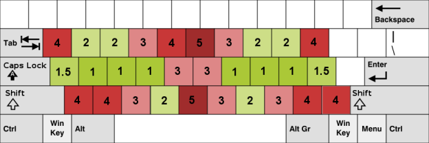
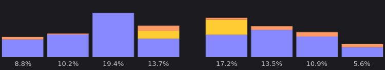
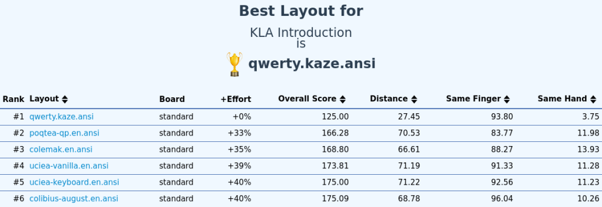
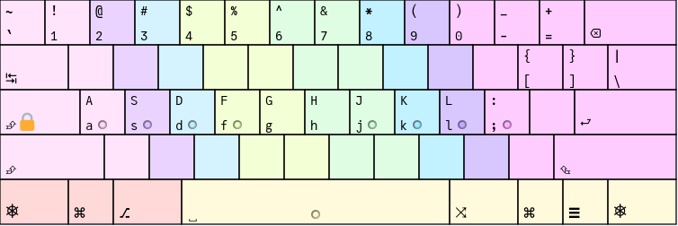

+++
title = "Analyser une disposition de clavier"
date = 2024-07-13T08:01:23+01:00
author = "kaze"
tags = ["communauté", "technique", "outils"]
+++

<!--
Étant mondialement connu pour mon objectivité totale, on me demande souvent des
trucs (et c’est bien normal). Notamment pour des questions liées aux claviers.

— C’est vrai qu’Ergo‑L est meilleur que Dvorak en anglais ?
— Totalement. En même temps, Dvorak date des années 1930, hein.
— Et meilleur que Bépo en français aussi ?
— Reste poli. Tu nous prends pour qui ?
— J’ai vu une variante de Bépo qui dit qu’elle est mieux.
— Haha, c’est mignon ça ! Mais non.
-->

Pour que chacun·e puisse comprendre en quoi Ergo‑L se distingue, quels sont les
avantages et inconvénients des autres layouts, et surtout, pourquoi
[Qwerty-Lafayette][] est le meilleur layout du monde, il était grand temps d’écrire
un article sur l’art délicat de l’analyse et de l’optimisation des dispositions
de clavier.

<!--more-->

Les fondamentaux
--------------------------------------------------------------------------------

Quels sont les principales caractéristiques d’une bonne disposition de clavier ?

### La heatmap

L’optimisation la plus évidente pour une disposition de clavier consiste à
placer les touches les plus fréquemment utilisées aux meilleurs emplacements :

- sur les 8 positions de repos
   ([A]{.kbd}[S]{.kbd}[D]{.kbd}[F]{.kbd} et [J]{.kbd}[K]{.kbd}[L]{.kbd}[;]{.kbd} en Qwerty)
- sur les 4 positions des majeurs et annulaires de la rangée supérieure
   ([W]{.kbd}[E]{.kbd} et [I]{.kbd}[O]{.kbd} en Qwerty)
- sur les 2 positions des index de la rangée inférieure
   ([V]{.kbd} et [M]{.kbd} en Qwerty)

Ces positions correspondent à celles notées 1 à 2 par le projet
[Workman](https://workmanlayout.org/#back-to-the-drawing-board).

On notera au passage que la question de l’accessibilité hors du pavé central de
3×10 touches ne s’est jamais posée chez Workman.

### La charge des doigts

Une autre optimisation de base consiste à équilibrer la charge de travail des
doigts :

- les doigts forts (index, majeur) peuvent supporter plus de charge que les
  auriculaires, qui sont déjà très sollicités avec [Entrée]{.kbd},
  [Backspace]{.kbd}, [Tab]{.kbd}, [Shift]{.kbd}…
- la charge est agravée par les extensions, i.e. les touches qui sont notées 3
  ou plus par le projet Workman (V. ci-dessus).

On affiche en bleu la charge liée aux touches notées 1 à 2, en jaune celle des
touches notées 3, et en orange celles notées 4 ou plus — ce qui inclut les
touches trop excentrées pour être évaluées par Workman, et qui enfreignent le
principe [1DFH][] auquel nous autres Ergonautes sommes si attachés.

### Les digrammes

Un digramme est un enchainement de deux touches.
Tout digramme appartient à l’une des catégories suivantes :

- alternance de mains : les touches sont sous deux mains différentes
- roulement : les touches sont sous deux doigts différents d’une même main
    - roulement intérieur : les touches s’enchainent de l’auriculaire vers l’index
    - roulement extérieur : les touches s’enchainent de l’index vers l’auriculaire
- digramme de même doigt (SFB) : deux touches différentes à enchainer avec le
  même doigt (= le pire enchaïnement qui soit)
- répétition (SKB) : la même touche est pressée deux fois.

Les roulements intérieurs sont considérés comme les enchainements les plus
confortables. Entre alternance de mains et roulements extérieurs, c’est plus une
question de préférence personnelle. On identifie aussi deux types de mauvais
roulements :

- les roulements avec « ciseau », qui requièrent un changement de rangée
  inconfortable, comme [C]{.kbd}[R]{.kbd} en Azerty ou Qwerty ;
- les roulements avec extension, qui incluent une touche notée 4 ou plus.

Les SFB sont les pires enchainements qui soient : une bonne optimisation
cherchera à en avoir le moins possible, et fera en sorte de ne pas avoir de SFB
ou SKB sous des auriclaires.

### Les trigrammes

Un trigramme est un enchainement de trois touches.
Les critères alternance / roulement / même doigt s’appliquent toujours, mais on
ajoute encore la notion de « redirection » pour les trigrammes faits d’une même
main avec un changement de direction, comme [D]{.kbd}[S]{.kbd}[F]{.kbd} ou
[K]{.kbd}[J]{.kbd}[L]{.kbd} en Azerty ou Qwerty.

La redirection est qualifiée de « mauvaise » quand elle ne fait pas intervenir
l’index.

Critères d’évaluation
--------------------------------------------------------------------------------

### Métriques consensuelles

Un analyseur de disposition de clavier va, en tout premier lieu, fournir des
métriques sur les principaux critères :

- la heatmap doit être centrée sur les positions confortables ;
- la charge des doigts doit être équilibrée et épargner les auriculaires ;
- le taux de SFB (= SFU, <i lang="en">same finger usage</i>) doit être le plus bas possible ;
- le taux de mauvaises redirections doit être le plus bas possible.

Le dernier point est moins souvent pris en considération, mais du point de vue
des Ergonautes c’est une grosse erreur que de le négliger.

### SHU, <i lang="en">same hand usage</i> ?

Le SHU mesure la répartition entre alternances de mains et roulements.

À l’époque des machines à écrire mécaniques, le SHU devait être le plus bas
possible car les roulements coinçaient souvent les marteaux : Qwerty, et encore
plus Dvorak, ont été développés dans cet objectif. C’est aussi le cas de Bépo et
ses nombreuses variantes.

Mais de nos jours, les claviers informatiques n’ayant pas de contrainte de ce
type, cette métrique du SHU n’est plus utilisée pour mesurer la qualité d’une
disposition — voire, elle est souvent utilisée dans l’autre sens : un SHU élevé
caractérise une disposition « rolly », i.e. privilégiant les roulements. C’est
le cas de la très grande majorité des dispositions modernes, dont Workman et
Ergo‑L.

:::{.highlight lang="en"}
> In designing Workman, I preferred a high SHU (low alternation) over a low SHU
> (high alternation). I think high alternation is beneficial if you’re typing on
> mechanical typewriters but not necessarily on modern keyboards. […]

> It is much more efficient to ride the momentum of a single arm or wrist stroke
> and type a combo rather than just one key.
:::
:::{style="text-align: right"}
— [kdeloach][], [Workman Keyboard Layout][]
:::

Attention : les dispositions de clavier qui privilégient les roulements prennent
le risque d’avoir un taux élevé de mauvaises redirections.
 
### Distance parcourue ?

Une métrique originale consiste à mesurer la distance parcourue par les doigts
pendant la saisie d’un texte. Elle a été rendue populaire par CarpalX et KLA :
facile à calculer, c’est toujours amusant de savoir combien de kilomètres nos
doigts parcourent pour saisir un texte. :-)

La communaté Ergonaute n’utilise pas cette métrique car elle n’est pertinente
que si l’on suppose que tous les déplacements de doigt se valent — ce qui est
évidemment faux (V. le § sur la [heatmap](#la-heatmap)).

### Note globale ?

Certains analyseurs de layout proposent une note globale, qui est une moyenne
pondérée de plusieurs critères plus objectifs. Si vous connaissez les critères
utilisés et êtes d’accord avec leur pondération, cette note globale peut donner
une évaluation générale appréciable lors des premières phases d’optimisation.

Mais il y a deux choses importantes à garder à l’esprit :

- une note globale ne rend pas compte des pires défauts de la disposition : ils
  sont soit noyés dans la moyenne, soit complètement ignorés ;
- quelle que soit sa qualité, une note globale ne sera jamais une bonne cible
  d’optimisation.

:::{.highlight}
> Lorsqu'une métrique devient un objectif, elle cesse d'être une bonne métrique.
:::
:::{style="text-align: right"}
— [loi de Goodhart](https://fr.wikipedia.org/wiki/Loi_de_Goodhart)
:::

Optimiser pour une note globale ?
--------------------------------------------------------------------------------

### Le piège (sournois)

S’il existait une note globale pertinente, n’importe qui avec des connaissances
basiques en développement logiciel aurait pu déterminer une disposition de
clavier optimale pour un corpus donné en appliquant un algorithme de [recuit
simulé][]. C’est ce qu’a fait [CarpalX][], qui est le projet le plus ancien et
le plus connu dans le domaine… et qui a abouti à des dispositions comme
[QFMLWY][] que personne n’utilise — et pour cause : CarpalX réussit bien à
proposer des dispositions ayant la meilleure note globale pour un corpus donné,
mais cette note étant trop peu pertinente, les dispositions obtenues n’ont pas
grand intérêt.

S’il existait une note globale pertinente mais que vous n’avez pas de compétence
en programmation, vous pourriez passer par un analyseur en ligne comme
[KLAnext][] qui propose ce type d’évaluation, et à force d’essais vous
obtiendriez une disposition très bien notée pour votre langue cible —
probablement le français, si vous lisez cet article. Vous pourriez alors amender
votre layout pour améliorer sa note en anglais, jusqu’à obtenir assez facilement
une note comparable aux meilleurs projets anglophones du moment : Colemak,
MTGAP, Sturdy… À ce stade, deux conclusions sont possibles :

- soit vous êtes un esprit supérieur comme le monde n’en connait que rarement —
  il y avait Einstein au XXe siècle, il y a vous au XXIe ;
- soit vous êtes tombé sur une faille de l’analyseur, et sans le savoir, vous
  avez optimisé pour cette faille.

Toute note globale étant imparfaite, optimiser pour une note globale va
**forcément** vous faire tomber dans ce travers. Pire, optimiser pour une note
globale peut vous faire perdre de vue certains critères importants : par
exemple, la note d’effort de CarpalX ne tient pas compte du SFU, et la note
globale de KLAnext ne tient pas compte de la heatmap (en plus de *pénaliser* les
roulements, mais c’est une autre histoire).

### *« [Qwerty-Lafayette][] est le meilleur layout du monde ! »*

C’est un plaisanterie récurrente de la communauté Ergonaute, en référence à ce
travers de note globale après que j’ai passé 10 minutes à jouer avec [KLAnext][]
et obtenu ce layout :

Ici je prends l’exemple de KLAnext avec un layout [volontairement
ridicule](https://mastodon.social/@fabi1cazenave/111806300874072301), mais c’est
vrai avec tous les analyseurs si on se contente d’optimiser pour un seul critère
— y compris celui qu’on a développé pour Ergo‑L. Ce n’est pas l’analyseur qui
est en cause, c’est son utilisation : aucune note globale n’étant pertinente,
vouloir évaluer ou classer des dispositions à cette aune est voué à l’échec.

Optimiser façon Ergonaute !
--------------------------------------------------------------------------------

### La méthode

Le crédo des Ergonautes est que **quel que soit le layout, son pire défaut se
ressentira toujours plus que ses meilleures qualités**. C’est l’approche que
l’on propose sur notre [comparateur](/alternatives/#tableau-comparatif) et qu’on
a suivie pendant toute la mise au point d’Ergo‑L, où on a itéré comme suit :

1. identifier le pire achoppement de la disposition (SFU, ciseau, redirection…) ;
2. améliorer notre analyseur pour qualifier et mesurer cet achoppement ;
3. trouver une modification du layout qui, sur la foi de l’analyseur, réduise
   cet achoppement ;
4. utiliser ce layout jusqu’à détecter un autre achoppement (généralement moins grave) ;
5. `GOTO 1`

On n’a donc jamais eu aucun usage d’une note globale. Au contraire, on regarde
toujours la pire note et les pires enchainements pour évaluer une disposition et
proposer des améliorations.

Cela dit, il y a bien une métrique que l’on regarde plus que les autres, c’est
le SFU : ça donne assez rapidement une idée de la marge d’optimisation qui reste
possible. Pour autant, et même si on est très fier du SFU d’Ergo‑L en français
comme en anglais, ça n’est pas un objectif en soi : [Nuclear-Squid][] a même rejeté
des versions de développement d’Ergo‑L qui avaient des SFU incroyablement bas,
mais qui causaient d’autres problèmes plus sournois à l’usage.

### Les outils

Les itérations de développement ont été facilitées par :

- [x‑keyboard][], pour tester nos layouts ;
- [kalamine][], pour générer et installer les pilotes ;
- [notre analyseur maison](/stats).

On a développé notre propre analyseur pour trois raisons :

- aucun analyseur existant ne prenait en compte les touches mortes, alors que
  toutes les dispositions francophones en font usage — et c’est même un élément
  fondamental d’Ergo‑L ;
- on a voulu mettre en lumière certains défauts de la disposition au fur et à
  mesure de l’avancement du projet, et qui n’étaient pas toujours pris en compte
  par les autres analyseurs : part des extensions dans la charge des doigts,
  qualification des redirections, repérage des ciseaux…
- c’était simple et fun à faire. :-)

Bien évidemment, on a vérifié que pour un même layout et un même corpus, notre
analyseur donnait les mêmes résultats que les analyseurs existants. Et bien sûr,
tout est disponible sous licence libre pour que chacun·e puisse étudier,
modifier, utiliser et rediffuser le tout comme bon lui semblera.

### La communauté

Faire une disposition de clavier pour soi-même est relativement aisé ; en faire
une qui convienne au plus grand nombre, c’est une autre histoire.

En particulier, on a tou·te·s des niveaux de tolérance différents à certains
défauts de layout : pour moi les extensions d’auriculaires sont particulièrement
pénibles, alors que d’autres préfèrent ça plutôt que d’utiliser AltGr ;
certain·e·s s’accomodent bien des ciseaux (notamment les utilisateurices de
claviers 3D), d’autres pas du tout ; et les mauvaises redirection sont le point
le plus clivant : certain·e·s s’y font, mais beaucoup trouvent ça rédhibitoire à
l’usage.

Pour prendre en compte toutes ses particularités, notre analyseur ne se contente
pas de mesurer chaque type d’achoppement mais les détaille en listant tous les
digrammes et trigrammes pouvant poser problème. Ça nous a fait gagner beaucoup
de temps en facilitant les échanges de la communauté Ergonaute pendant le
développement d’Ergo‑L.

Les autres analyseurs
--------------------------------------------------------------------------------

Notre analyseur n’est ni le premier, ni le dernier à être développé. Petit tour
d’horizons des autres analyseurs parmi les plus connus et les plus utiles.

### CarpalX

TODO

### KLA, KLAnext

TODO

### Colemak-DH

TODO

### Sturdy

TODO

Conclusion
--------------------------------------------------------------------------------

- il n’y a pas de mauvais analyseur, juste des mauvaises façons de s’en servir :
- il n’y a pas de bonne note globale, ni de bonne façon de s’en servir ;
- chaque métrique est importante, car on a tous nos préférences et nos ressentis.

Un grand merci à [Nuclear-Squid][], non seulement pour avoir initié et dirigé le
projet Ergo‑L, mais plus prosaïquement pour sa contibution à la rédaction du
chapitre sur les autres analyseurs. Que le Grand Palmipède parsème son chemin de
pétales de roses.

[1DFH]:                    /presentation/#dfh-1u-distance-from-home
[Qwerty-Lafayette]:        https://qwerty-lafayette.org
[Nuclear-Squid]:           https://github.com/Nuclear-Squid
[kdeloach]:                https://github.com/kdeloach
[Workman Keyboard Layout]: https://workmanlayout.org/#same-hand-utilization-shu
[recuit simulé]:           https://fr.wikipedia.org/wiki/Recuit_simulé
[CarpalX]:                 https://mk.bcgsc.ca/carpalx/
[QFMLWY]:                  https://mk.bcgsc.ca/carpalx/?full_optimization
[KLAnext]:                 https://klanext.keyboard-design.com
[x‑keyboard]:              https://github.com/OneDeadKey/x-keyboard
[kalamine]:                https://github.com/OneDeadKey/kalamine
